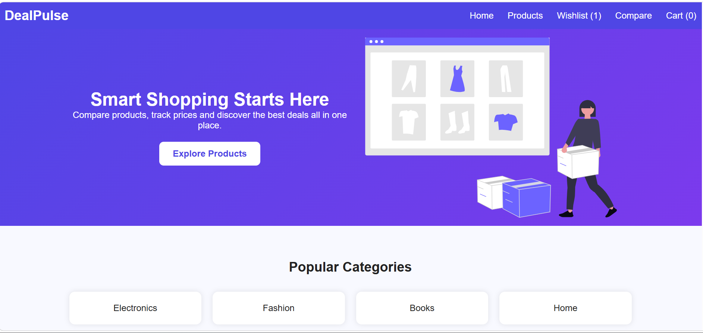
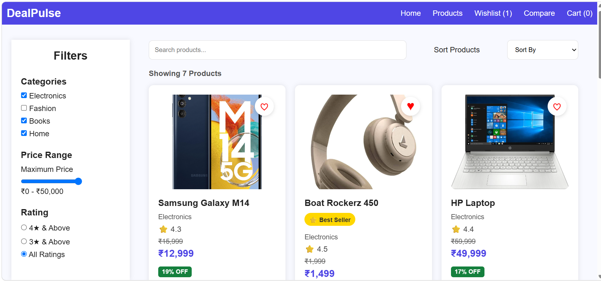
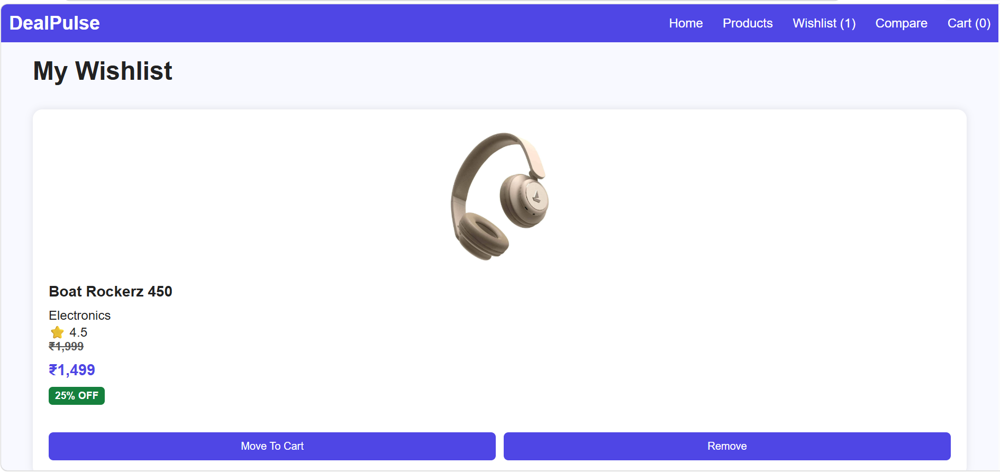
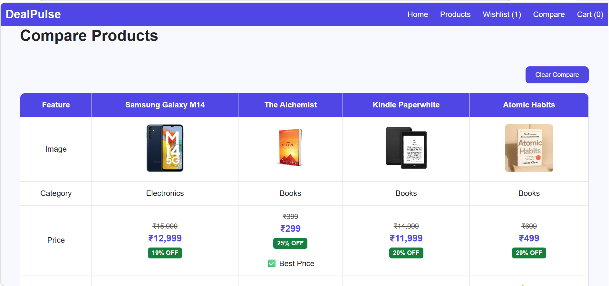
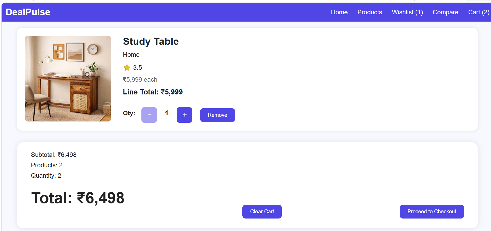
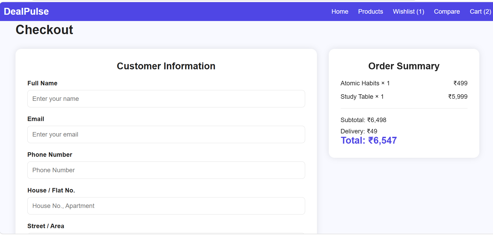

# DealPulse 🛍️

DealPulse is a smart product comparison and shopping assistant web application that helps users compare products, manage wishlists, track prices and make informed purchasing decisions.

## 🌐 Live Demo

https://dealpulse-eosin.vercel.app

## 🚀 Features

### 🏠 Home Page
- Hero section with featured products
- Popular category shortcuts
- Responsive design

### 📦 Products Page
- Product listing with images, ratings, prices, and discounts
- Search products by name
- Filter by:
  - Category
  - Price Range
  - Rating
- Sort by:
  - Price: Low to High
  - Price: High to Low
  - Rating
- Add products to Cart
- Add products to Wishlist
- Add products to Compare

### ❤️ Wishlist
- Save favorite products
- Remove products from wishlist
- Move products directly to cart

### 🛒 Shopping Cart
- Add products to cart
- Increase/Decrease quantity
- Remove products
- Clear cart
- Dynamic order summary

### ⚖️ Product Comparison
- Compare up to 4 products side-by-side
- Highlight:
  - Best Price
  - Highest Rated Product
- Responsive comparison table

### 🔍 Product Details
- Detailed product information
- Stock status
- Related products
- Recently viewed products

### 💳 Checkout
- Customer information form
- Address details
- Payment method selection
- Order summary
- Form validation

### 📱 Responsive Design
- Mobile-friendly layouts
- Optimized for different screen sizes

---

## 🛠️ Technologies Used

- HTML5
- CSS3
- JavaScript (ES6)
- Local Storage API

---

## 📂 Project Structure

```
DealPulse
│
├── index.html
├── products.html
├── product.html
├── cart.html
├── wishlist.html
├── compare.html
├── checkout.html
├── order-success.html
│
├── css
│   ├── style.css
│   ├── products.css
│   ├── product.css
│   ├── cart.css
│   ├── compare.css
│   ├── checkout.css
│   ├── wishlist.css
│   └── order-success.css
│
├── js
│   ├── home.js
│   ├── products.js
│   ├── product.js
│   ├── cart.js
│   ├── wishlist.js
│   ├── compare.js
│   ├── checkout.js
│   └── navbar.js
│
├── data
│   └── products.js
│
├── assets/
│   └── images/
│       ├── atomic-habits.webp
│       ├── boat-rockerz.webp
│       ├── hp-laptop.webp
│       ├── kindle-paperwhite.webp
│       ├── mens-hoodie.webp
│       ├── samsung-m14.jpg
│       ├── shopping.svg
│       ├── sports-shoes.jpg
│       ├── study-table.jpeg
│       └── the-alchemist.webp
└── README.md 
```

---

## 🎯 Key Highlights

- Dynamic filtering and sorting
- Product comparison functionality
- LocalStorage-based cart and wishlist management
- Responsive UI
- Lighthouse optimized
- Client-side form validation

---

## 🔮 Future Improvements

- User Authentication
- Backend Integration
- Real-time Price Tracking
- Product Reviews & Ratings
- Order History
- Dark Mode
- Payment Gateway Integration

---

## 📸 Screenshots

| Home Page | Products Page |
|-----------|--------------|
|  |  |

| Wishlist | Compare |
|-----------|----------|
|  |  |

| Cart | Checkout |
|------|----------|
|  |  |
  

---

## 👩‍💻 Author

**Kohina**  
B.Tech Computer Science Engineering  
Mody University of Science and Technology

---

## 📄 License

This project is developed for educational and portfolio purposes.