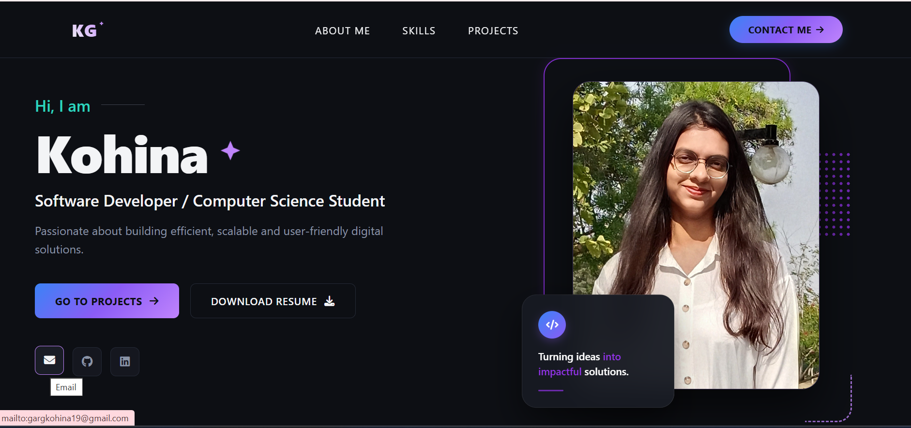

# 🚀 Modern Software Developer Portfolio

Welcome to my personal portfolio website! This is a clean, sleek, and highly responsive single-page portfolio built with modern front-end web technologies. The project features a premium dark mode layout accented with a customized vibrant violet, purple, and lavender glowing aesthetic.



## ✨ Features

*   **Premium Dark UI Architecture:** Built with a smooth slate-black background (`#090B0E`) and cohesive purple/lavender accent points.
*   **Dynamic Cover Landing:** Implements a fixed vertical viewport structure (`100vh`) highlighting clean action links (`Go to Projects`, `Download Resume`).
*   **Interactive Script Components:** Structured with vanilla JavaScript to handle smooth scrolling, dynamic navigation transitions, and responsive mobile behavior.
*   **Decorative UI Frames:** Beautifully aligned offset accent lines, matrix dot arrays, and dashed layout vectors wrapped seamlessly around the profile showcase.
*   **Integrated Action Cards:** Floating micro-layout components featuring automated hover states and embedded highlight parameters.
*   **Themed Skills Grid:** A custom-styled matrix of development skills utilizing unified ambient glow micro-filters (`drop-shadow`) and precise textual hierarchies.

---

## 🛠️ Tech Stack & Dependencies

*   **Core Structure:** HTML5
*   **Styling Engine:** CSS3 (incorporating modern CSS Variables, Flexbox, and CSS Grid layouts)
*   **Interactivity Engine:** JavaScript (ES6+ Vanilla JS)
*   **Icon Typography:** FontAwesome 6+ (Solid & Brand packages)
*   **Typography:** Google Fonts (Inter / Poppins or your custom portfolio selections)


---

## 📂 Project Architecture

```text
├── index.html                  # Main application structural layout
├── style.css                   # Core cascading style engine (Sections 1-5 layout fixes)
├── script.js                   # JavaScript logic for interactive components and animations
├── Kohina.jpeg                 # Main profile portrait capture asset
├── Kohina_Resume(overleaf).pdf # Integrated recruiter download document source
├── portfolio-preview.png       # Live preview screenshot used in this README
└── README.md                   # Documentation guide (this file)